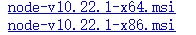

#你好萌萌

#安装GitBook

首先创建一个Gitbook的文件夹，路径最好都是英文路径，打开文件夹所在的终端输入以下命令。

#安装node.js

`node -v`用于检测是否安装node.js。如果没有安装进入[node.js官网](https://nodejs.org/en/)下载node.js

注意最新版node.js使用GitBook会报错，这里推荐最简单的方法就是如果安装了最新的node.js则卸载node.js后，打开node官网版本库[10.22.1版本](https://nodejs.org/dist/v10.22.1/)进行下载。

#安装npm

`npm -v`用于检测是否安装npm包管理工具。npm为node.js的包管理工具，安装node.js时会顺便安装npm。

两个都显示有版本号了以后，输入以下方法从NPM安装GitBook。

##安装全局GitBook

只需要安装一次。

`npm install gitbook-cli -g`

#为书创建目录和文件

在命令行输入`gitbook init`

enter之后会出现下面两个文件。

到这一步我们就构建了一本简单的书籍，README.md文件经常用于书籍的介绍而不是主要内容。SUMMARY.md是作为目录使用。

#目录的使用

可以在目录中直接添加目录和子章节目录。

构建好目录之后使用`gitbook init`会自动在文件夹中创建目录中的文件。

目录可以根据自己的喜好来编排，也可以使用文件嵌套的格式来设计

#启动服务器生成静态网页

在命令行输入`gitbook serve`

<u>**一个简单的网页文档就完成了**</u>